# Go 内存分配器可视化指南
当我第一次开始尝试理解 Go 语言的内存分配器时，整个过程让我抓狂。一切看起来都像一个神秘的黑盒子。因为几乎所有技术魔法（technical wizardry）都隐藏在抽象之下，所以你需要一层一层的剥离才能去理解它。

我们将通过这篇文章来一层层的剥离这些细节。如果你想学习所有关于 Go 内存分配器的知识，那么这篇文章正适合你。

## 物理内存和虚拟内存

每一个内存分配器都需要运行在由底层操作系统管理的虚拟内存空间（Virtual Memory Space）之上。

下图是一个物理内存单元（Physical Memory Cell）的简要说明（非精准）

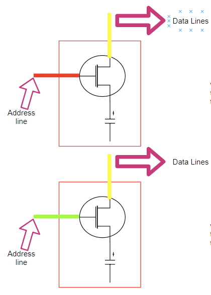

一个内存单元的概述经过大大简化之后描述如下：

1. 地址线（Address line）（晶体管做的开关）用于访问电容器（数据到数据线（Data Lines））。
2. 如果地址线有电流流动（显式为红色），数据线可以写入到电容器，所以电容器带电，逻辑值表示 “1”。
3. 如果地址线没有电流流动（显式为绿色），数据线不可以写入到电容器，所以电容器不带电，逻辑值表示 “0”
4. 当 CPU 需要从 RAM 中“读取”值，则顺着“地址线（ADDRESS LINE）”（关闭开关）发送一个电流。如果电容器带电，则电流流向“数据线（DATA LINE）”（值为 1）；否则没有电流流向数据线，所以电容器保持不带电（值为 0）。

下图简单的描述 CPU 和物理内存单元如何交互

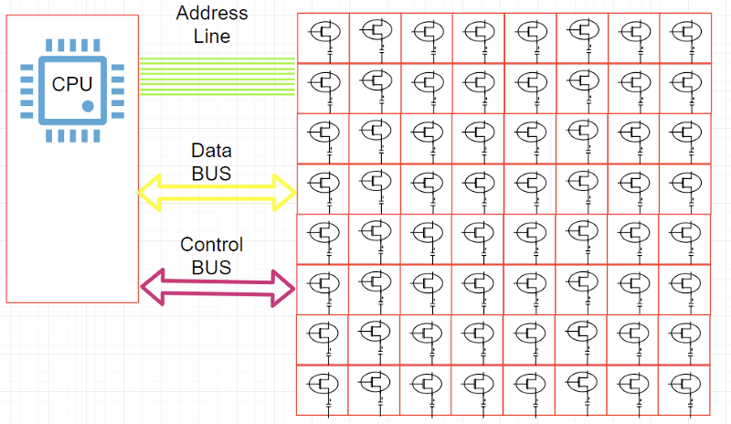

**数据总线（Data Bus）**：用于在 CPU 和内存中间传输数据。

还有一点关于**地址线（Address line）**和**按字节寻址（Addressable bytes）**。

下图是 CPU 和物理内存之间地址线的说明

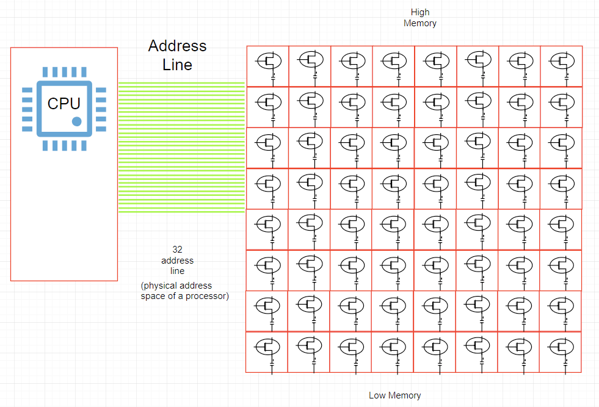

1. [DRAM] 中的每一个字节都分配了一个唯一的数字标识符（地址）。“**物理字节 != 地址线的数量（Physical bytes present != Number of address line）**”（e.g. 16 位 Intel 8088、[PAE]）
2. 每一个“地址线”可以发送 1-bit 的值，用于表示给定字节地址中的“一个位（SINGLE BIT）”
3. 在我们的上面给出的图中，我们有 32 个地址线。所以每个 **字节（BYTE）** 都有“32 位”作为地址。

    - `[ 00000000000000000000000000000000 ]` — 低内存地址
    - `[ 11111111111111111111111111111111 ]` — 高内存地址
    
4. 由于我们每字节都有一个 32 位的地址，所以我们的地址空间包含 2 的 32 次方个可寻址字节（bytes）（4GB）。

综上所述，可寻址的字节数量取决于地址总线的数量，所以对于 64 个地址线最大可寻址 2 的 64 次方个字节数（16 [EB]），但是由于大部分架构实际上仅使用 48-bit 地址线（AMD）和 42-bit 地址线（Intel）作为 64-bit 指针，所以理论上允许 256TB 物理内存（Linux 在 x86-64 下通过 [with 4 level page tables] 允许每个处理器 128TB 地址空间，Windows 192TB）。

由于物理内存的大小是受限制的，所以进程运行在自身的内存沙盒内 -- “虚拟内存地址（virtual address space）”，称作 **虚拟内存（Virtual Memory）**。

**字节的地址在这个虚拟地址空间内不再和处理器放在地址总线上的地址相同**。因此必须建立转换数据结构和系统将虚拟地址空间中的字节映射到物理字节。

虚拟地址表示参见下图（`/proc/$PID/maps`）：

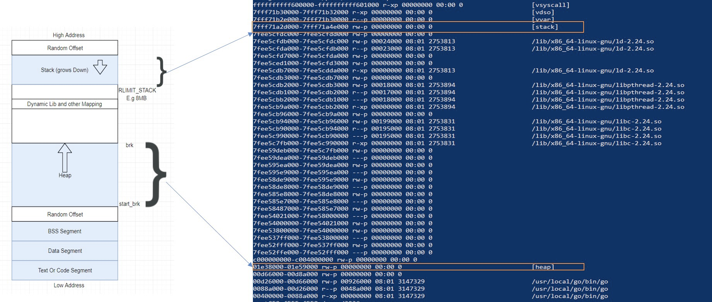

综上所述当 CPU 执行一个指令需要引用内存地址时。首先将在 VMA（Virtual Memory Areas）中的逻辑地址转换为线性地址。这个转换通过 [MMU] 完成。


由于逻辑地址太大几乎很难独立的管理，所以引入术语 **页（pages）** 进行管理。当必要的分页操作被激活后，**虚拟地址空间被分成更小的称作页的区域**（大部分操作系统下是 4KB，可以修改）。页是虚拟内存中数据内存管理的最小单元。虚拟内存不存储任何内容，只是简单的将程序地址空间映射到底层物理内存之上。

独立的进程只能使用 VMA  作为他们的地址。**所以当我们的程序需要更多 “堆内存（heap memory）时发生了什么？**

下图是简单的汇编代码用于分配更多的堆内存

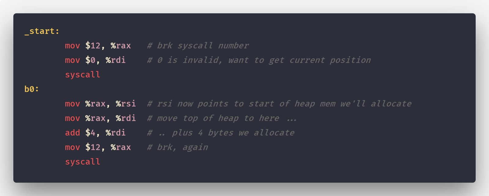

下图描述堆内存的增长

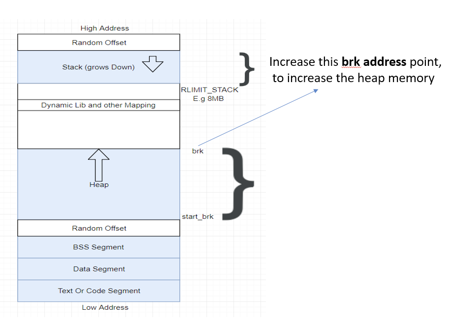

应用程序通过系统调用 [brk](http://man7.org/linux/man-pages/man2/brk.2.html)（`sbrk`/`mmap` 等）获得内存。内核仅更新堆 VMA 并调用它。

> 当前时间点实际上不分配页帧且新页在物理内存中并不存在。这也是 VSZ 和 RSS 大小的不同点。

## 内存分配器

通过对“虚拟地址空间”基本了解和它对在堆分配的意义，内存分配器现在变得更加容易解释。

> 如果堆上有足够的空间的满足我们代码的内存申请，内存分配器可以完成内存申请无需内核参与，否则将通过操作系统调用（`brk`）进行扩展堆，通常是申请一大块内存。（对于 `malloc` 大默认指的是大于 `MMAP_THRESHOLD` 个字节 - 128KB）。

但是，内存分配器除了更新 `brk address` 还有其他职责。其中主要的一项就是如何**减少** `内部（internal）`和`外部（external）`碎片和如何快速分配当前块。考虑我们的程序以串行的方式（p1 到 p4）通过 `malloc(size)` 函数申请一块连续的内存然后通过 `free(pointer)` 函数进行释放。

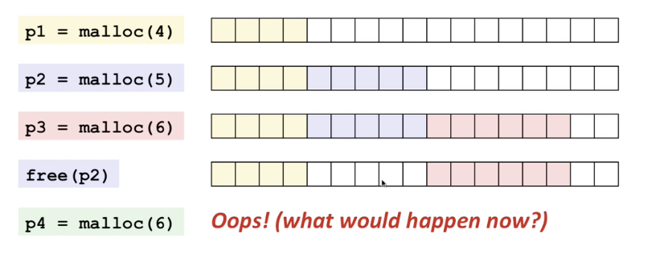

在 p4 阶段由于内存碎片化即使我们有足够的内存块依然无法满足申请的 6 个连续的内存块。

**所以我们该如何减少内存碎片化呢** ？答案取决是使用哪种内存分配算法，也就是使用哪个底层库。

我们将简单看一下一个和 Go 内存分配器建模相近的内存分配器： `TCMalloc`。

## TCMalloc

[TCMalloc] 的核心思想是将内存分为多个级别缩小锁的粒度。在 TCMalloc 内存管理内部分为两个部分：**线程内存（thread memory)**和**页堆（page heap）**。

### 线程内存

每一个内存页都被分为多个固定分配大小规格的空闲列表（`free list`） 用于减少碎片化。这样每一个线程都可以获得一个用于无锁分配小对象的缓存，这样可以让并行程序分配小对象（<=32KB）非常高效。

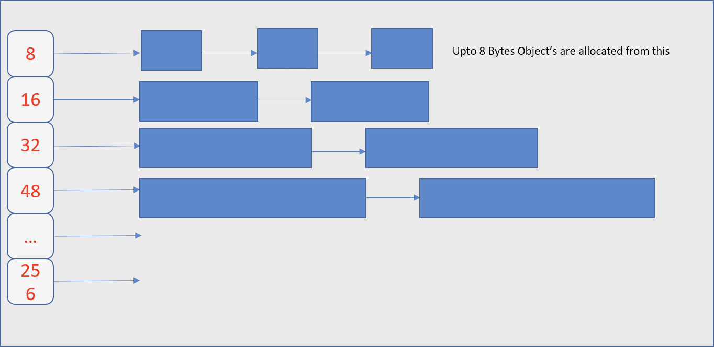

### 页堆

TCMalloc 管理的堆由一组页组成，**一组连续的页面被表示为 span**。当分配的对象大于 32KB，将使用页堆（Page Heap）进行内存分配。

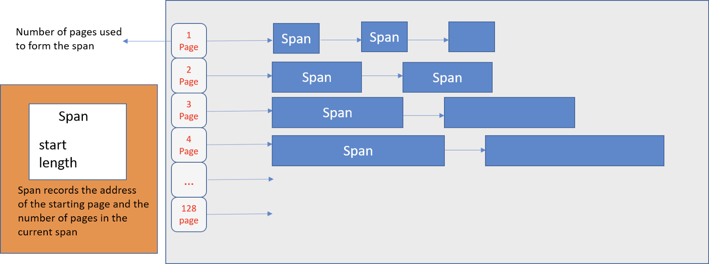

当没有足够的空间分配小对象则会到页堆获取内存。如果页堆页没有足够的内存，则页堆会向操作系统申请更多的内存。

> Note: 即使 Go 的内存分配器最初是基于 TCMalloc，但是现在已经有很大的不同。

## Go 内存分配器

我们知道 Go 运行时（Go Runtime）调度器在调度时会将 **Goroutines(G)** 绑定到 **逻辑处理器（P）(Logical Processors）** 运行。类似的，Go 实现的 TCMalloc 将内存页（Memory Pages）分为 67 种不同大小规格的块。 

> 如果你不熟悉 Go 的调度器可以先参见《[
Go scheduler: Ms, Ps & Gs
](https://povilasv.me/go-scheduler/)》,然后继续阅读。

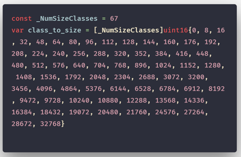

如果页的规格大小为 1KB 那么 Go 管理粒度为 **8192B** 内存将被切分为 8 个像下图这样的块。

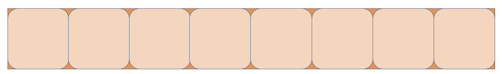

Go 中这些页通过 **mspan** 结构体进行管理。

### mspan

简单的说，`mspan` 是一个包含页起始地址、页的 span 规格和页的数量的双端链表。

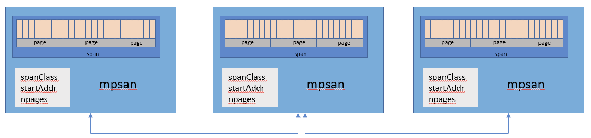

### mcache

Go 像 TCMalloc 一样为每一个 **逻辑处理器（P）（Logical Processors）** 提供一个本地线程缓存（Local Thread Cache）称作 **mcache**，所以如果 Goroutine 需要内存可以直接从 **mcache** 中获取，由于在同一时间只有一个 Goroutine 运行在 **逻辑处理器（P）（Logical Processors）** 上，所以中间不需要任何锁的参与。

**mcache** 包含所有大小规格的 **mspan** 作为缓存。

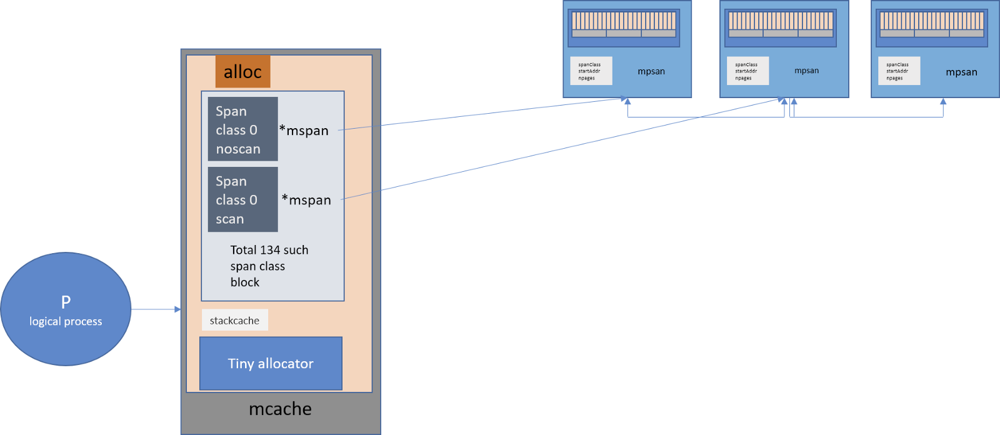

> 由于每个 P 都拥有各自的 mcache，所以从 mcache 分配内存无需持有锁。

对于每一种大小规格都有两个类型：

1. **scan** -- 包含指针的对象。
2. **noscan** -- 不包含指针的对象。

采用这种方法的好处之一就是进行垃圾回收时 **noscan** 对象无需进一步扫描是否引用其他活跃的对象。

#### mcache 的作用是什么？

> `<=32K` 字节的对象直接使用相应大小规格的 **mspan** 通过 `mcache` 分配

#### 当 mcache 没有可用空间时会发生什么？

从 **mcentral** 的 mspans 列表获取一个新的所需大小规格的 `mspan`。

### mcentral

`mcentral` 对象收集所有给定规格大小的 span。每一个 `mcentral` 都包含两个 mspan 的列表：

1. **empty** mspanList -- 没有空闲对象或 span 已经被 mcache 缓存的 span 列表
2. **nonempty** mspanList -- 有空闲对象的 span 列表

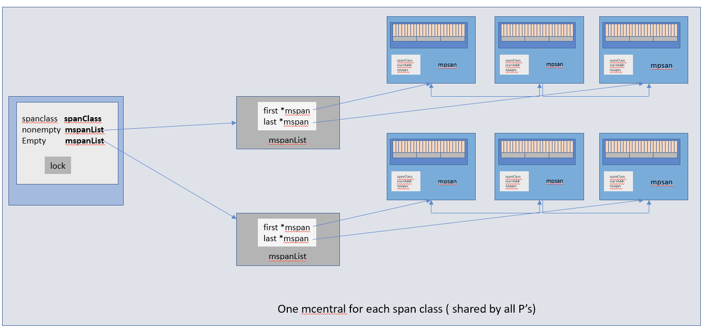

每一个 mcentral 结构体都维护在 **mheap** 结构体内。

### mheap

> Go 使用 mheap 对象管理堆，只有一个全局变量。持有虚拟地址空间。

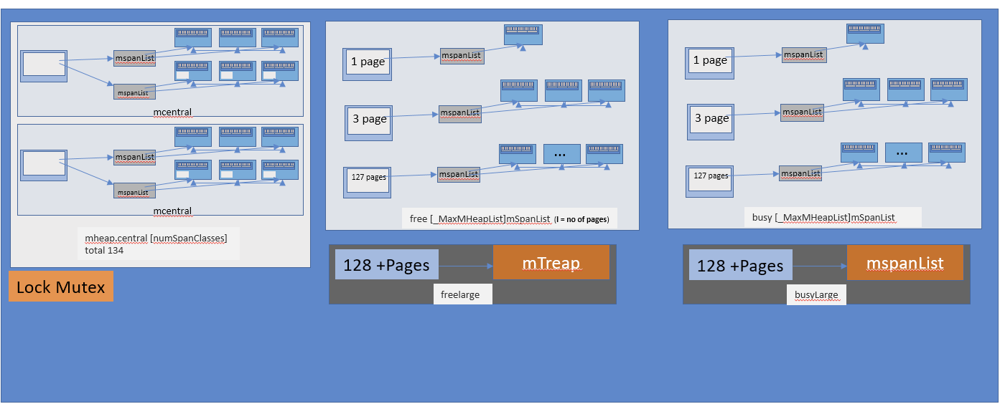

就上我们从上图看到的：**mheap 存储了 mcentral 的数组**。**这个数组包含了各个的 span 的 mcentral**。

```go
central [numSpanClasses]struct {
  	mcentral mcentral
    	pad      [sys.CacheLineSize unsafe.Sizeof(mcentral{})%sys.CacheLineSize]byte
}
```
> 由于我们有各个规格的 span 的 mcentral，当一个 **mcache** 从 mcentral 申请 **mspan** 时，只需要在独立的 **mcentral** 级别中使用锁，所以其它任何 **mcache** 在同一时间申请不同大小规格的 **mspan** 将互不受影响可以正常申请。

对齐填充（Padding）用于确保 mcentrals 以 *CacheLineSize* 个字节数分隔，所以每一个 *MCentral.lock* 都可以获取自己的缓存行（cache line），以避免[伪共享（false sharing）](https://en.wikipedia.org/wiki/False_sharing)问题。

当 **mcentral** 列表空的时候会发生什么？**mcentral** 从 **mheap** 获取一系列页用于需要的大小规格的 span。

- **free[_MaxMHeapList]mSpanList**：一个 `spanList` 数组。每一个 `spanList` 中的 **mspan** 包含 1 ~ 127（_MaxMHeapList - 1）个页。例如，`free[3]` 是一个包含 3 个页的 **mspan** 链表。`free` 表示 `free list`，表示未分配。对应 `busy list`。
- **freelarge mSpanList**：一个 **mspan** 的列表。每一个元素(mspan)的页数大于 127。通过 `mtreap` 结构体管理。对应 `busylarge`。

> 大于 32K 的对象被定义为大对象，直接通过 mheap 分配。这些大对象的申请是以一个全局锁为代价的，因此任何给定的时间点只能同时供一个 P 申请。

## 对象分配流程

- 大于 32K 的大对象直接从 **mheap** 分配。
- 小于 16B 的使用 **mcache** 的微型分配器分配
- 对象大小在 16B ~ 32K 之间的的，首先通过计算使用的大小规格，然后使用 **mcache** 中对应大小规格的块分配
- 如果对应的大小规格在 **mcache** 中没有可用的块，则向 **mcentral** 申请
- 如果 **mcentral** 中没有可用的块，则向 **mheap** 申请，并**根据 BestFit 算法找到最合适的 mspan**。如果申请到的 **mspan** 超出申请大小，将会根据需求进行切分，以返回用户所需的页数。剩余的页构成一个新的 **mspan** 放回 **mheap** 的空闲列表。
- 如果 **mheap** 中没有可用 span，则向操作系统申请一系列新的页（最小 1MB）。

    > 但是 Go 会在操作系统分配超大的页（称作 arena）。分配一大批页会减少和操作系统通信的成本。

**所有在堆上的内存申请都来自 arena**。让我们看看 arena 是什么。

## Go 虚拟内存

让我们看一个简单的 Go 程序的内存情况

```go
func main() {
    for {}
}
```
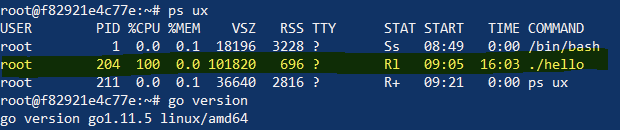

从上面可以即使是一个简单的程序虚拟空间占用页大概 `~100MB` 左右，但是 RSS 仅仅占用 `696KB`。让我们先搞清楚这之间的差异。

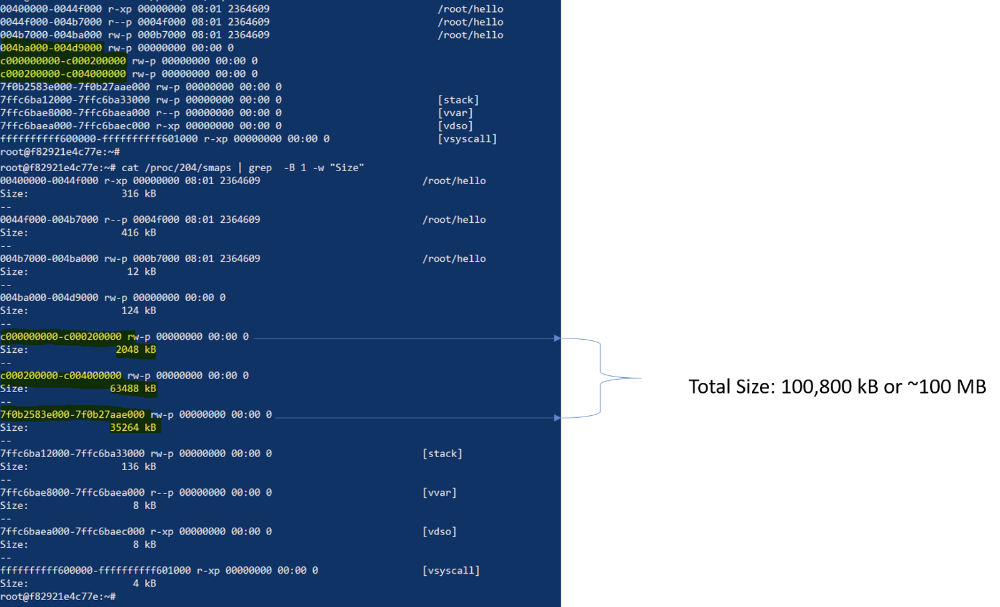

这里有一块内存区域大小在 ~ `2MB`、`64MB` 和 `32MB`。这些是什么？

### Arena

事实证明 Go 的虚拟内存布局中包含一系列 **arenas**。初始的堆映射是一个 **arena**，如 `64MB`（基于 go 1.11.5）。

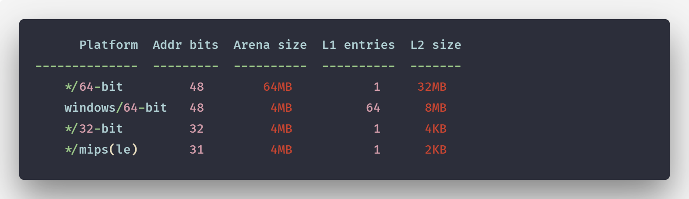

所以当前内存根据我们的程序需要以小增量映射，并且初始于一个 arena（~64MB）。

请首先记住这些数字。主题开始改变。早期 Go 需要预先保留一个连续的虚拟地址，在一个 64-bit 的系统 arena 的大小是 512GB。（如果分配的足够大且 **被 mmap 拒绝** 会发生什么？）

**这些 arenas 就是我们所说的堆**。在 Go 中每一个 arena 都以 `8192B` 的粒度的页进行管理。

下图表示一个 64MB 的 arena


Go 同时存在其他两个块：**span** 和 **bitmap**。**两者都在堆外分配并且包含每个 arena 的元数据**。大多用于垃圾回收期间（所以我们就讨论到这）。

----

在我们刚刚讨论的 Go 的内存分配策略种类里，只涉及到内存分配奇妙且多样性的冰山一角。

然而，Go 内存管理的一般思想是使用不同的内存结构为不同大小的对象使用不同的内存缓存级别来分配内存。将一个从操作系统接收的连续地址的块切分到多级缓存来减少锁的使用，同时根据指定的大小分配内存减少内存碎片以提高内存分配的效率和在内存释放之后加快 GC 运行的速度。

现在我们将通过下图结束 Go 内存分配可视化指南。

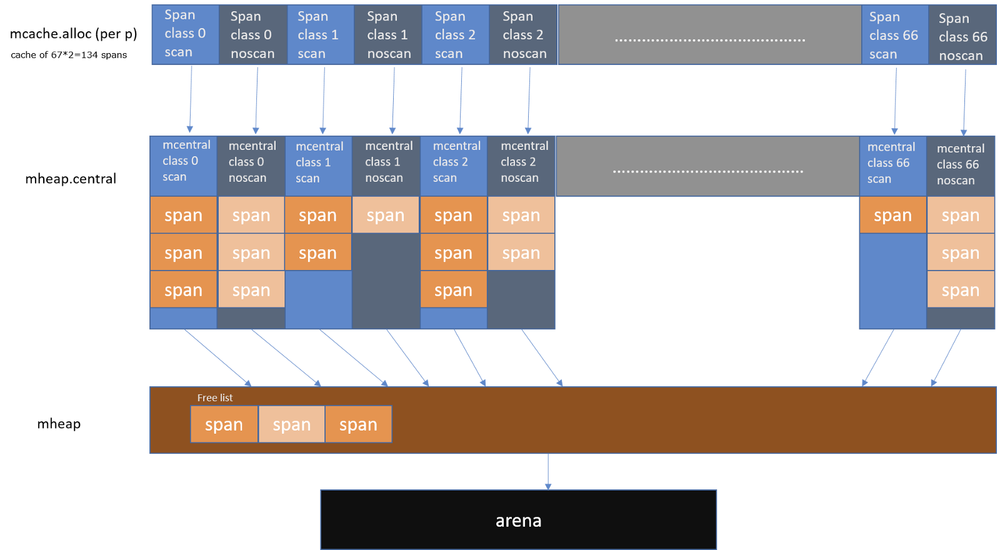

----

翻译参考：

- [总线内部结构](http://share.onlinesjtu.com/mod/tab/view.php?id=253)
- [DRAM]
- [PAE]
- [Byte addressing]
- [内存管理]

----

原文链接 [A visual guide to Go Memory Allocator from scratch (Golang)](https://blog.learngoprogramming.com/a-visual-guide-to-golang-memory-allocator-from-ground-up-e132258453ed)

[TCMalloc]: http://goog-perftools.sourceforge.net/doc/tcmalloc.html
[PAE]: https://zh.wikipedia.org/wiki/%E7%89%A9%E7%90%86%E5%9C%B0%E5%9D%80%E6%89%A9%E5%B1%95
[DRAM]: https://zh.wikipedia.org/zh/%E5%8A%A8%E6%80%81%E9%9A%8F%E6%9C%BA%E5%AD%98%E5%8F%96%E5%AD%98%E5%82%A8%E5%99%A8
[Byte addressing]: https://www.wikiwand.com/en/Byte_addressing
[EB]: https://zh.wikipedia.org/wiki/%E8%89%BE%E5%AD%97%E8%8A%82
[with 4 level page tables]: https://www.kernel.org/doc/Documentation/x86/x86_64/mm.txt
[内存管理]: https://www.csie.ntu.edu.tw/~wcchen/asm98/asm/proj/b85506061/chap2/overview.html
[MMU]: https://zh.wikipedia.org/wiki/%E5%86%85%E5%AD%98%E7%AE%A1%E7%90%86%E5%8D%95%E5%85%83
