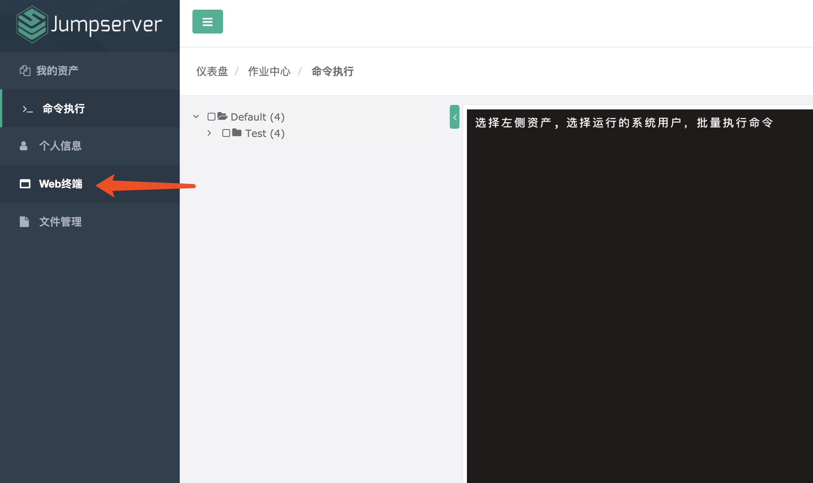
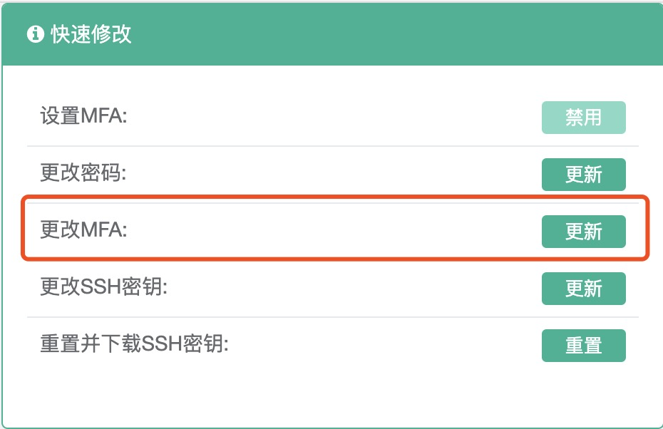
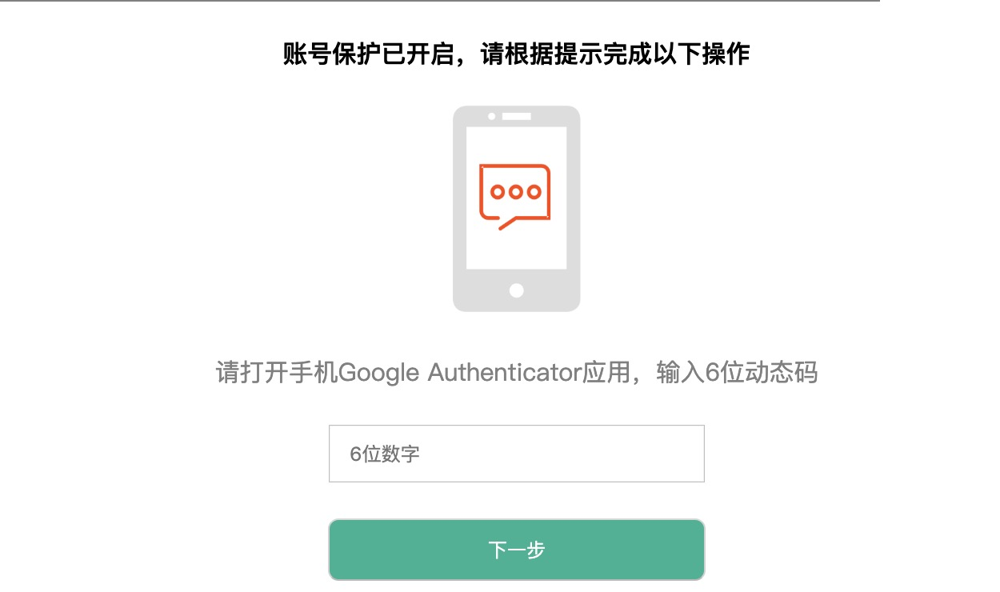
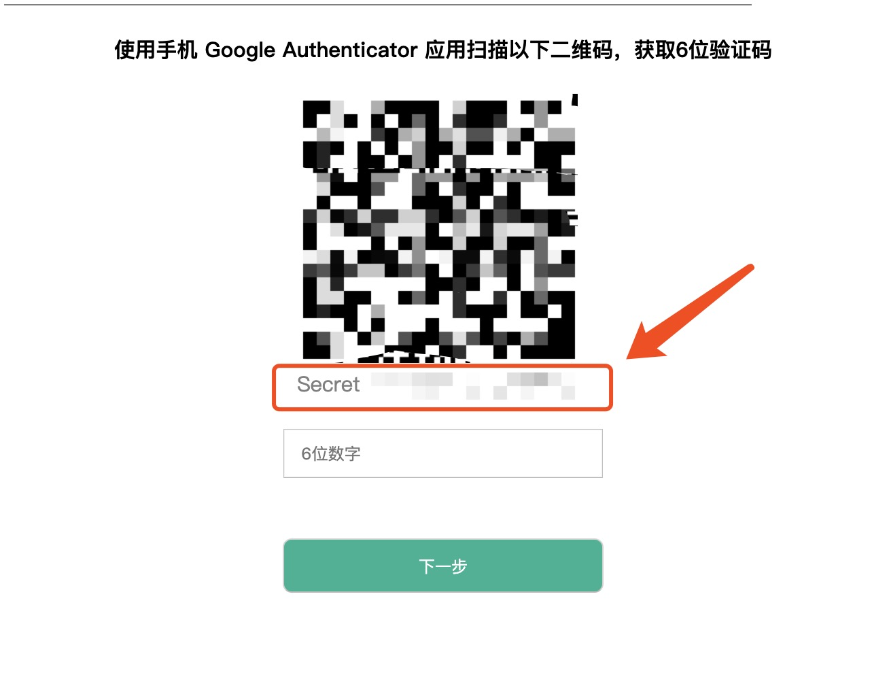

## JumpServer SHELL

- `情景`

> 有没有感觉每次用跳板机输入 MFA 二步认证很不爽， 当我们每次要调试的时候




#### Pass Step

```$xslt
    1. 打开 https://jump.xxx.io/users/login/?next=/users/profile/,输入用户名密码
    2. 选择 Web 终端 ,进入测试机器去调试
```

    这样其实很浪费时间🤷‍️，我们喜欢终端，喜欢ssh直接去连服务器（当然只是测试环境，调试环境）😑
    
    所以接下来，我们祭出我们最拿手的shell,来帮我们完成这些繁琐的步骤
---


#### Now

##### Prepare 前提准备

```$xslt
    # 安装 oath-toolkit
    1. 对于其他操作系统 https://gitlab.com/oath-toolkit/oath-toolkit
    2. 对于Mac🤣: brew install oath-toolkit 
```

    修改MFA $secret  https://jump.xxx.io/users/profile/




##### SHELL 

> version 1  

- 具体操作步骤 1. `sh jump.sh`  2. `ctrl + v` 即粘贴 MFA code （6 位数验证码）

- shell 变量 

`$secret= xxxxxxxxxxxxxxxxxxx`                                 //code \
`pem_file=/path`                                               //ssh 证书路径 \
`dst_address = username(or eamil)@jumpserver`                  //要访问的 jump server

```bash
    # jump.sh
    oathtool --totp -b $secret| pbcopy  # 获取 验证码
    ssh -p 2222 -i pem_file dst_address # 端口指定，这里假如是 2222 
```

> 缺点： 需要先 sh 命令执行，然后 粘贴操作 直接连行不行，不想粘贴😅


---

> version 2 简单粗暴,一步到位


```bash
    # jump.sh
    code=`oathtool --totp -b $secret` # 替换MFA CODE
    echo  "MFA code:",$code
    expect -c "
    spawn ssh -p 2222 -i pem_file dst_address 
    expect {
    	MFA {send \"$code\r\"; exp_continue}
    }
    "
```

> 这下好了，直接连接 jump server 👍 

##### more 我还想再方便一点 🤣

```bash
    alias jump='sh path/jump.sh'
```
